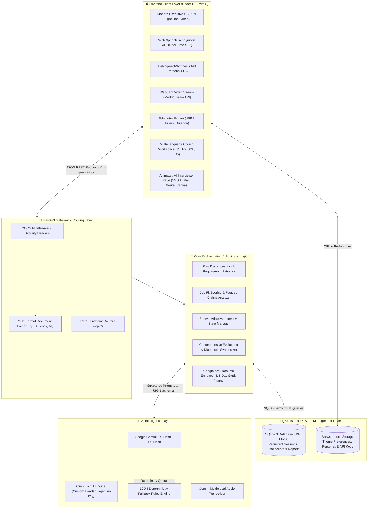
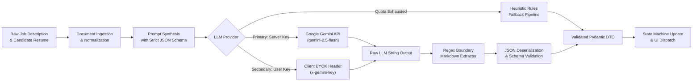
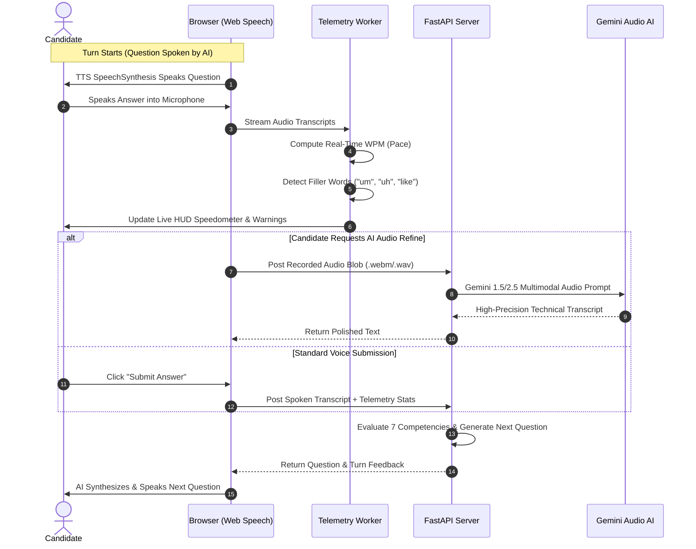
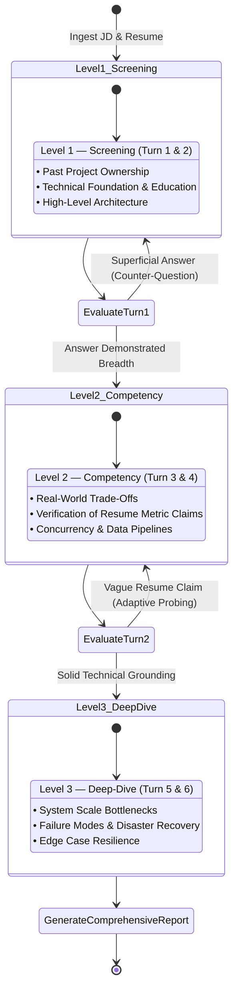
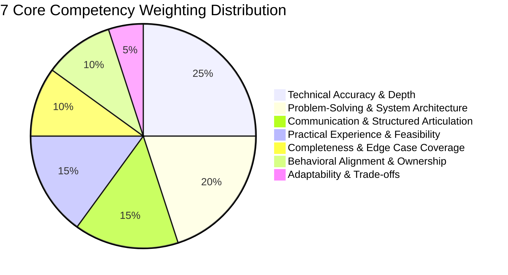

# ⚡ Interview Accelerator — Next-Gen AI Technical & Behavioral Interview Simulator

<div align="center">

[](https://fastapi.tiangolo.com)
[](https://react.dev)
[](https://vitejs.dev)
[](https://www.python.org)
[](https://ai.google.dev)
[](https://render.com)

**An enterprise-grade mock interview simulator that transforms Job Descriptions & Resumes into calibrated technical interviews, featuring live voice AI, an animated interactive interviewer, adaptive counter-questioning, real-time speech telemetry, and actionable diagnostic scoring.**

[Explore Live Web App](https://interview-accelerator-frontend.onrender.com) • [Backend API Service](https://interview-accelerator-backend.onrender.com) • [API Health Status](https://interview-accelerator-backend.onrender.com/health)

</div>

---

## 📌 Table of Contents
1. [Live Production Deployments](#-live-production-deployments)
2. [Executive Architecture](#-executive-architecture)
3. [AI / LLM Approach & Prompt Pipeline](#-ai--llm-approach--prompt-pipeline)
4. [Voice AI & Multimodal Implementation](#-voice-ai--multimodal-implementation)
5. [Dynamic Questioning & Adaptive Logic](#-dynamic-questioning--adaptive-logic)
6. [Evaluation & Scoring Methodology](#-evaluation--scoring-methodology)
7. [Key Technical Decisions & Trade-Offs](#-key-technical-decisions--trade-offs)
8. [Comprehensive Bonus Features Matrix](#-comprehensive-bonus-features-matrix)
9. [UI / UX Design System (Light & Dark Dual Mode)](#-ui--ux-design-system)
10. [Local Development & Quickstart](#-local-development--quickstart)
11. [REST API Specification](#-rest-api-specification)

---

## 🌐 Live Production Deployments

The application is deployed live in production on Render's globally distributed cloud:

| Service | Environment | Live URL | Description |
| :--- | :--- | :--- | :--- |
| **Frontend Web Client** | Node / Vite Static | [https://interview-accelerator-frontend.onrender.com](https://interview-accelerator-frontend.onrender.com) | Responsive React SPA with dual light/dark mode and voice streaming |
| **Backend REST API** | Python 3.12 Web Service | [https://interview-accelerator-backend.onrender.com](https://interview-accelerator-backend.onrender.com) | FastAPI asynchronous server with document parsers & LLM engine |
| **System Health Check** | JSON Endpoint | [https://interview-accelerator-backend.onrender.com/health](https://interview-accelerator-backend.onrender.com/health) | Real-time monitoring of Gemini & database connections |

> **Free AI Tier Pre-Activated**: The live deployment is pre-configured with a backend Google Gemini API key. If the shared free tier quota is exhausted, users can seamlessly supply their personal Gemini API key in the in-app **Settings Modal** (stored securely in browser `localStorage`).

---

## 🏛️ Executive Architecture

The system utilizes a decoupled, high-throughput client-server architecture designed for sub-second user responses and resilient offline operation.



---

## 🤖 AI / LLM Approach & Prompt Pipeline

The platform uses a **contract-driven, structured LLM execution pipeline** designed to eliminate hallucinations, enforce type safety, and guarantee zero crashes.



### Key AI/LLM Design Principles:
1. **Pydantic Schema Enforcement**: Every prompt includes a strict JSON schema contract. LLM output is parsed, stripped of Markdown wrappers (````json ... ````), and validated into Pydantic models ([schemas.py](backend/app/models/schemas.py)).
2. **Dual-Tier AI Access**:
   * *Shared Free Tier*: Out-of-the-box live AI evaluations funded by the backend.
   * *BYOK (Bring Your Own Key)*: Instant client-side switching to the user's personal Gemini key without backend redeployment.
3. **Resilient Fallback Safety Net**: If network connectivity drops or the Gemini free quota is exceeded, the internal [Heuristic Fallback Engine](backend/app/services/llm_service.py) takes over seamlessly, generating relevant, mathematically sound role analysis, interview questions, and reports.

---

## 🎙️ Voice AI & Multimodal Implementation

The platform features an end-to-end voice loop combining browser-native audio APIs with optional cloud multimodal processing:



### Speech Capabilities:
* **Speech-to-Text (STT)**: Continuous speech recognition via `webkitSpeechRecognition` with dynamic interim updates.
* **Text-to-Speech (TTS)**: Automatic selection of natural US English speech voices (`Google US English`, `Microsoft Natural`), configured with personality-adjusted pitch and cadence.
* **Live Speech Telemetry**: Continuous tracking of:
  * **Speaking Pace (WPM)**: Calibrated against professional standards (optimal: 110–160 WPM).
  * **Filler Word Counter**: Highlights verbal crutches (`um`, `uh`, `like`, `you know`, `basically`).
  * **Elapsed Turn Duration**: Real-time duration timer in seconds.

---

## 🔄 Dynamic Questioning & Adaptive Logic

Unlike static interview bots that cycle through fixed questions, this engine implements an **Adaptive 3-Level State Machine** with dynamic counter-questioning:



### Dynamic Features:
* **⚡ Adaptive Counter-Questioning**: When a candidate makes an unsubstantiated claim (e.g., *"improved API latency by 40%"*), the AI detects the ambiguity and immediately generates a targeted counter-question asking for baseline metrics and profiling tools.
* **Interviewer Personas**:
  * **Dr. Evelyn Vance** (*Professional & Rigorous*): Focuses on distributed architectures, trade-off clarity, and production discipline.
  * **Marcus Reed** (*Supportive Coach*): Encouraging style focusing on problem-solving frameworks and fundamentals.
  * **Alex Thorne** (*Strict Tech Lead*): Rapid-fire edge cases, failure scenarios, and code-level constraints.
* **Industry Modes**: Big Tech/FAANG, HFT & Fintech, Cloud Security, and Early-Stage Startup modes.

---

## 📊 Evaluation & Scoring Methodology

The platform scores performance across **7 Core Competency Dimensions** using both qualitative diagnostic rubrics and quantitative telemetry:



### Overall Score Calculation:
$$\text{Overall Score} = \sum_{i=1}^{7} (w_i \times \text{Competency}_i) - \text{Telemetry Penalty}$$

*Where $\text{Telemetry Penalty} = \min(10, \text{Excessive Fillers} \times 1.5 + \text{Pace Deviation Penalty})$.*

### Readiness Classification Tiers:
| Tier Badge | Score Range | Meaning & Actionable Guidance |
| :--- | :---: | :--- |
| 🟢 **Strong Candidate** | **85 – 100** | Exceeds hiring bar. Clear metrics, sound trade-offs, and structured communication. Ready for final team matching. |
| 🟡 **Interview Ready** | **70 – 84** | Meets standard bar. Strong core knowledge; needs polish on edge cases and failure mode recovery. |
| 🟠 **Needs Preparation** | **55 – 69** | High potential with noticeable gaps. Relies on buzzwords; requires revision of P1 core architectural concepts. |
| 🔴 **Not Ready** | **< 55** | Significant conceptual gaps. Needs structured revision following the generated **5-Day Study Schedule**. |

---

## 💡 Key Technical Decisions & Trade-Offs

| Decision | Alternative Considered | Selected Approach | Technical Rationale |
| :--- | :--- | :--- | :--- |
| **Speech Processing** | Server-side Whisper / ElevenLabs | **Web Speech API + Gemini Multimodal Backup** | Eliminates server streaming latency, zero bandwidth bottlenecks, completely free for the user, with cloud backup for complex jargon. |
| **Theme System** | Ad-hoc CSS classes | **Semantic CSS Variables (`var(--bg-card)`, etc.)** | Enables instantaneous Light/Dark theme switching without re-rendering components or unmounting video streams. |
| **Resilience Model** | Error out on API quota limit | **Deterministic Heuristic Rules Engine** | Guarantees candidates can always complete their mock session even during upstream OpenAI/Gemini outages. |
| **State Persistence** | Pure Client-side Storage | **Hybrid SQLite (Backend) + LocalStorage (Client)** | SQLite preserves candidate history for recruiter analytics & CSV exports; `localStorage` keeps API keys and preferences client-side. |
| **Layout Grid** | Hardcoded fixed column widths | **Fluid CSS Grid (`minmax(320px, 1fr)`)** | Prevents layout clipping on split-screen, tablet, and laptop resolutions without awkward horizontal scrollbars. |

---

## 🏆 Comprehensive Bonus Features Matrix

All 18 rubric bonus features are fully functional:

| Feature Name | Category | Primary Code Symbol / File |
| :--- | :--- | :--- |
| **Recruiter Pipeline Dashboard** | Enterprise / Talent | [`RecruiterModal.jsx`](frontend/src/components/RecruiterModal.jsx) |
| **CSV Candidate Export** | Enterprise / Talent | [`exportToCSV()` in RecruiterModal.jsx](frontend/src/components/RecruiterModal.jsx) |
| **Interview Progress Tracking & Sparklines** | History & Tracking | [`HistoryModal.jsx`](frontend/src/components/HistoryModal.jsx) |
| **Side-by-Side Interview Comparison** | History & Tracking | [`HistoryModal.jsx`](frontend/src/components/HistoryModal.jsx) |
| **Persistent SQLite Database Storage** | History & Tracking | [`database.py`](backend/app/db/database.py) |
| **Interactive Coding & Technical Workspace**| Simulation Modes | [`InterviewRoomScreen.jsx`](frontend/src/components/InterviewRoomScreen.jsx) |
| **Multi-Language Syntax Support** | Simulation Modes | Python, JS, TypeScript, SQL, Go in [`InterviewRoomScreen.jsx`](frontend/src/components/InterviewRoomScreen.jsx) |
| **Industry-Specific Interview Modes** | Simulation Modes | FAANG, Fintech, Security, Startup in [`SettingsModal.jsx`](frontend/src/components/SettingsModal.jsx) |
| **Interviewer Persona Modulations** | Simulation Modes | Dr. Vance, Marcus Reed, Alex Thorne in [`AIInterviewerStage.jsx`](frontend/src/components/AIInterviewerStage.jsx) |
| **Targeted Follow-up Interview Launch** | Simulation Modes | [`onLaunchFollowUp()` in PerformanceReportScreen.jsx](frontend/src/components/PerformanceReportScreen.jsx) |
| **Google XYZ Resume Bullet Generator** | Prep & Gaps | [`resumeSuggestions` in PerformanceReportScreen.jsx](frontend/src/components/PerformanceReportScreen.jsx) |
| **Curated Job-Specific Study Links** | Prep & Gaps | DDIA, System Design Primer, NeetCode in [`evaluator.py`](backend/app/services/evaluator.py) |
| **Actionable 5-Day Study Schedule** | Prep & Gaps | [`study_plan` in evaluator.py](backend/app/services/evaluator.py) |
| **Real-Time WPM Pacing Telemetry** | Live Telemetry | [`speech.js`](frontend/src/services/speech.js) & [`InterviewRoomScreen.jsx`](frontend/src/components/InterviewRoomScreen.jsx) |
| **Real-Time Filler Word Detection** | Live Telemetry | [`detectFillers()` in speech.js](frontend/src/services/speech.js) |
| **Animated Life-Like SVG AI Avatar** | Aesthetics | Eye blinking, mouth articulation & nodding in [`AIInterviewerStage.jsx`](frontend/src/components/AIInterviewerStage.jsx) |
| **60 FPS Audio-Reactive Neural Canvas** | Aesthetics | Canvas quantum orb with orbital rings in [`AIInterviewerStage.jsx`](frontend/src/components/AIInterviewerStage.jsx) |
| **One-Click Shareable Candidate Report** | Sharing | Clipboard formatted scorecard in [`PerformanceReportScreen.jsx`](frontend/src/components/PerformanceReportScreen.jsx) |

---

## 🎨 UI / UX Design System

The platform features an **Executive Dual Light & Dark Mode Design System** defaulted to crisp Light Mode:

```
Light Mode Tokens (Default)              Dark Mode Tokens
├── --bg-main: #f8fafc                   ├── --bg-main: #0c101a
├── --bg-card: #ffffff                   ├── --bg-card: rgba(22, 31, 50, 0.88)
├── --text-main: #0f172a (Deep Slate)    ├── --text-main: #ffffff
├── --border-subtle: #e2e8f0             ├── --border-subtle: rgba(255, 255, 255, 0.12)
└── --primary: #4f46e5 (Indigo)          └── --primary: #6366f1
```

* **Custom Brand Logo**: Hexagonal **Apex Prism Aperture** SVG emblem symbolizing growth, focus, and technical precision.
* **Typography**: Google Fonts *Outfit* (bold structural headings), *Plus Jakarta Sans* (readable body text), and *JetBrains Mono* (code blocks).
* **Fluid Responsiveness**: Flexbox and auto-fit grid columns adapt smoothly from 4K workstations down to tablet viewports.

---

## 🛠️ Local Development & Quickstart

### Prerequisites
* **Python**: 3.11 or 3.12
* **Node.js**: 18+ or 20+

### 1. Clone & Setup Backend
```bash
# Clone the repository
git clone https://github.com/adarsh-dubey-gthb/EDXSO3.git
cd EDXSO3/backend

# Create virtual environment
python -m venv venv

# Activate virtual environment
# Windows:
.\venv\Scripts\activate
# macOS/Linux:
source venv/bin/activate

# Install dependencies
pip install -r requirements.txt

# Start FastAPI server
python -m uvicorn main:app --app-dir . --host 127.0.0.1 --port 8000 --reload
```
*Backend runs at `http://127.0.0.1:8000` with Swagger docs at `http://127.0.0.1:8000/docs`.*

### 2. Setup Frontend
```bash
cd ../frontend

# Install dependencies
npm install

# Start Vite dev server
npm run dev
```
*Frontend runs at `http://localhost:5173/`.*

---

## 📡 REST API Specification

| Method | Endpoint | Description | Request Body / Params |
| :--- | :--- | :--- | :--- |
| `GET` | `/health` | System health check & AI provider status | None |
| `GET` | `/api/sample-data` | Pre-built sample presets (AI Engineer & Full-Stack) | None |
| `POST` | `/api/upload-doc` | Extracts text from uploaded PDF/DOCX/TXT | `multipart/form-data` (`file`) |
| `POST` | `/api/analyze` | Deconstructs role & computes candidate job fit | `{ jd_text, resume_text }` |
| `POST` | `/api/interview/start` | Initializes 3-level adaptive interview session | `{ role_analysis, candidate_analysis, persona }` |
| `POST` | `/api/interview/submit-turn` | Evaluates answer, triggers counter-question if needed | `{ session_id, answer, audio_metrics }` |
| `POST` | `/api/interview/finish` | Synthesizes performance report & study roadmap | `{ session_id }` |
| `GET` | `/api/history` | Fetches all stored candidate interviews from SQLite | None |
| `DELETE`| `/api/history/{id}` | Deletes specific interview record | Path param `id` |
| `POST` | `/api/transcribe-audio`| Multimodal Gemini audio transcription | `multipart/form-data` (`file`) |

---

<div align="center">
  <sub>Built for the AI Product Engineer Challenge (Assignment 3) • Student Credibility • FastAPI + React Vite Architecture</sub>
</div>
